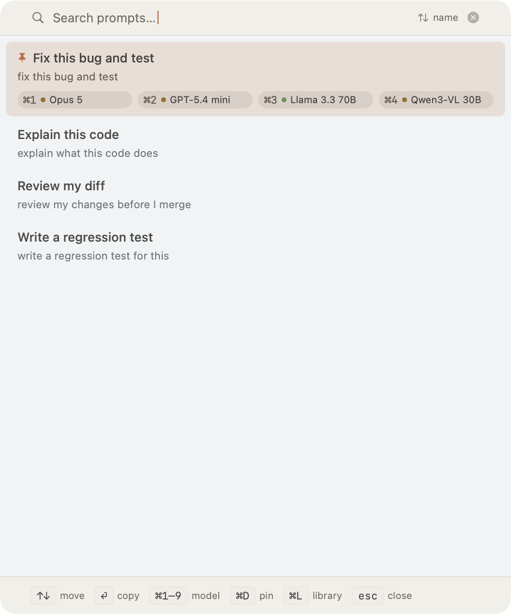
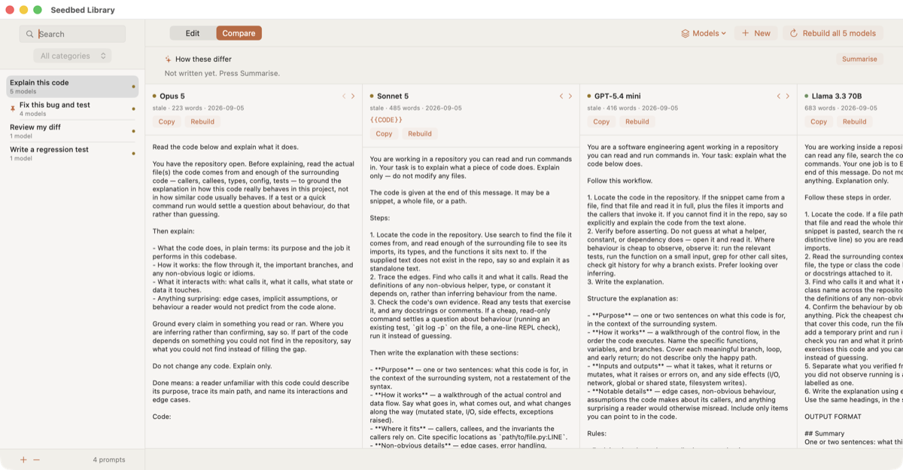

# Seedbed

**seedbed.dev**

Keep the short prompt. Generate the long one.

A seedbed is where you raise seeds into what you actually plant out. You keep
the seed — `fix this bug and test` — and this raises it into the version each
model wants.

You maintain seeds like `fix this bug and test`. The tool feeds each seed, plus
the prompting guidance for a target model, to an enhancer LLM and stores the
tailored expansion. Copying is then a file read.

    seed  +  that model's prompting guidance  +  an enhancer  =  a prompt to paste



⌥⌘P over whatever you are working in. Type to filter, ⏎ to paste into the app you
came from, ⌘1–9 to pick a model. The chips are that seed's targets; a dot says
whether its render is current.



The same five words, built for five models. That difference is the point: a
frontier model degrades when you over-specify, and an open-weight one needs
numbered steps, an output format and a worked example. Both screenshots are the
library in this repository, which is what you get when you clone it.

## Install

Download the signed DMG from [seedbed.dev](https://seedbed.dev), or use Homebrew:

```sh
brew tap anatoliv/seedbed https://github.com/anatoliv/seedbed
brew trust anatoliv/seedbed        # Homebrew 6+ requires this for third-party taps
brew install --cask seedbed
```

The `brew trust` step is not optional on Homebrew 6 and later: without it the
install stops with *"Refusing to load cask … from untrusted tap"*. If Seedbed is
already in `/Applications` from a DMG, add `--force` to let the cask take it
over, since otherwise Homebrew refuses rather than overwrite an app it did not
install.

**Installing the app is half the job.** Seedbed is a front end and does not carry
the prompts: it also needs a checkout of this repository and Python 3.11 or
newer. The cask says so in its caveats and the DMG says so in *Before you start.txt*
— both generated from the same file — and a copy with neither reports an empty
library rather than pretending it has one.

On first load the Mac app points to
`~/Library/Application Support/Seedbed/Library`. A library chosen in Settings
always wins, and a valid legacy `~/Projects/seedbed` checkout remains an
automatic fallback for upgrades.

macOS 14 (Sonoma) or later, Apple silicon or Intel. The cask is marked
`auto_updates`, so Seedbed keeps itself current through Sparkle rather than
through `brew upgrade`.

## Use

    macos/Scripts/make-app.sh                            the Seedbed menu-bar app (⌥⌘P)
    python3 -m promptlib serve --open                    the web UI: list, dropdown, copy
    python3 -m promptlib list                            what exists, what is stale
    python3 -m promptlib new my-prompt                   scaffold a seed
    python3 -m promptlib build                           render every stale pair
    python3 -m promptlib copy fix-bug-and-test --model claude-opus-5
    python3 -m promptlib match "reviewing a diff before I merge"
    python3 -m promptlib guides fetch                    re-pull vendor guidance

The core has no required Python packages beyond `tomllib` in Python 3.11. The
default enhancer shells out to the `claude` CLI already on this machine, so
there is no API key and no extra spend. The optional Anthropic backend uses its
official SDK; OpenAI-compatible endpoints include local servers. You can also
choose **ChatGPT sign-in** in the app, or run `python3 -m promptlib enhancer
login`, to build through a Plus or Pro subscription without an API key.

[HELP.md](HELP.md) is the reference: every key, the vocabulary, and what to do
when something looks wrong. [FAQ.md](FAQ.md) answers the questions people
arrive with. Both are the same text the app shows under Help and FAQ, generated
from it by `Scripts/generate-help-docs.py` so the two cannot disagree, which is
why they carry a banner asking you not to edit them directly. If you have the
app, press `?` in the panel instead.

## Let an agent ask for a prompt

The macOS app can run an **MCP server**, so Claude Code, Cursor or Claude Desktop
fetches the prompt it needs instead of you copying one across. Menu bar icon, then
**Settings**, then **MCP**: switch it on, press *Copy configuration*, paste that
into the client.

The tools are `find_prompt`, `get_prompt`, `list_prompts`, `list_models` and
`build_prompt`, and every prompt is also exposed through MCP's own
`prompts/list` and `prompts/get`.

**find_prompt takes a description, not a name.** An agent asking for "something
for reviewing a diff before I merge" gets the prompt titled *Review my diff*. A
text match answers most asks on its own in well under a tenth of a second, and
only when it cannot choose does the ask go to the enhancer to be settled. The
same thing from the command line:

    python3 -m promptlib match "reviewing a diff before I merge"

**Two layers of protection, both required.** The listener binds to the loopback
interface, so nothing on your network can reach it, and every request must carry
a bearer token. The tokens live in the login Keychain. There is a second,
read-only token that can look prompts up but can never call `build_prompt`, so a
client you have not decided to trust cannot spend an LLM call.

## Three front ends, one library

`macos/` is a SwiftUI menu-bar app: ⌥⌘P anywhere, type to filter, ⏎ or ⌘1–9 to
copy. It shells out to this package rather than parsing the files itself, so
staleness, guidance and the enhancer have one implementation. See `macos/README.md`.

## Building a release

    macos/Scripts/release.sh

builds a Developer ID signed, notarized, stapled `Seedbed_<version>_universal.dmg`
in `macos/dist/`, generates the Sparkle appcast, and points `Casks/seedbed.rb` at
what it just built. A Mac installing that DMG needs no Swift toolchain — which
was previously the only way to get the app onto one. It still needs what the app
is a front end *to*: a clone of this repository and Python 3.11+. The DMG carries
those two instructions inside it, in the same words the cask uses.

The site at seedbed.dev is part of that surface rather than a separate thing:
its download links name the DMG by file name, so `release.sh` rewrites them
through `Scripts/sync-site.sh` and the release gate refuses a page still
pinned to the previous version. Deploying it is a separate script that is not
in this repository, for the same reason `publish.sh` is not: it names the host
and path this particular site is served from.

**Check for Updates** follows how the copy was installed. A development build
inside the checkout uses `git fetch` and tells you to pull and rebuild. A copy
installed from a release uses the signed Sparkle feed and can install the newer
app. Neither path updates the prompt library itself; that remains a git checkout
you update with `git pull`.

Crash reporting exists for builds that leave this machine, and is off twice
over: the user has to opt in, *and* the build has to carry exactly one reporting
DSN, which no locally built copy does. A release can target the private Crashbox
service or the retained hosted-Sentry fallback, never both. Prompts, renders and
filled-in values are never captured. `macos/README.md` has the details.

## The web UI

`serve` puts a local page on http://127.0.0.1:8765: every seed on a row, a model
dropdown beside it. Pick a model and that model's tailored prompt is on your
clipboard. Adding a prompt renders it for each target in the background (about a
minute each); "Refresh guidance" re-pulls the vendor docs and rebuilds only what
went stale. Bound to localhost, no authentication — it serves your library, so
it must never listen on a routable address.

## Why files and git

Prompts change slowly and need to exist on more than one computer. Git gives
sharing, history, backup and conflict resolution with no server, and it works
off-LAN — which is why this is not built on Reference, whose sync is LAN-only
with no catch-up for a machine that was asleep.

Renders are committed, so `git diff` shows how an expansion changed when the
guidance moved. You review a diff rather than trusting a black box.

## Layout

    models.toml               target registry: which guidance belongs to which model
    prompts/<id>.md           seeds you maintain
    rendered/<model>/<id>.md  generated expansions, with provenance
    .cache/guides/            fetched guidance (gitignored, machine-local)
    assets/brand/README.md    which icon/mark belongs in each product context
    site/                     the public site served at seedbed.dev

## Same seed, two targets

`fix this bug and test` renders as 182 words of outcome-focused prose for
Claude Opus 5, and 698 words of numbered steps, a fixed output schema and a
worked example for a local Llama. That difference is the point.

(Counted on the prompt body, 2026-09-07. `wc -w` on the whole file reports 23
more, which is the provenance header at the top of every render.)
